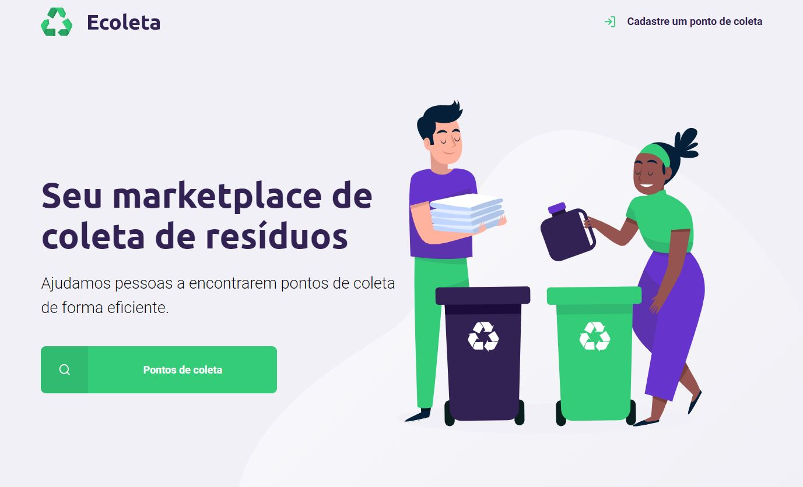
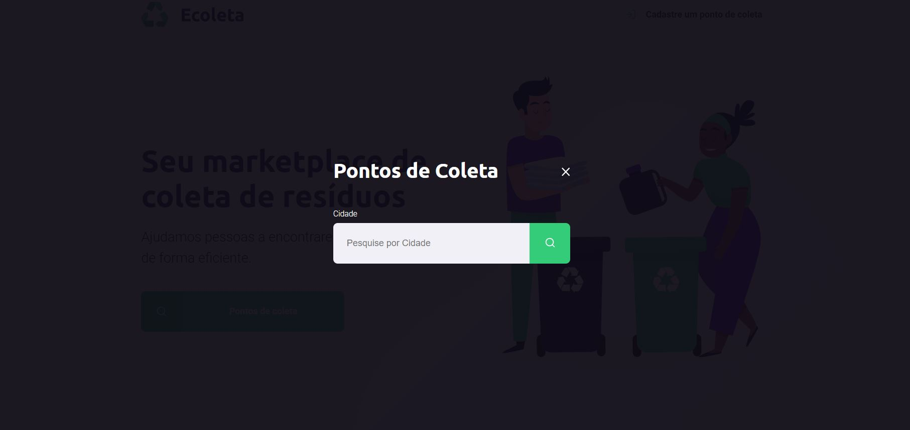
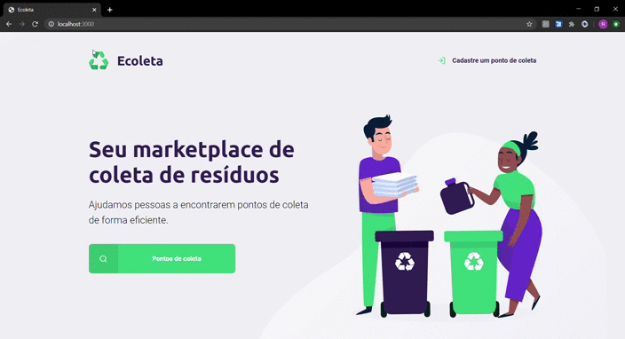

# Ecoleta
 Projeto que visa, cadastrar e identificar pontos de coleta de resíduos.
---

# Linguagem e Frameworks
---
* HTML
* CSS
* JavaScript
* NodeJS
* Express
* Template engine ( Nunjucks )
* Banco de dados ( SQLLite3 )

---
# Imagens da Aplicação 
---
**Página Principal**

**Página de cadastro de Entidade**

**Tela de busca por Localidade**

**Tela de resultado da busca**

---

# Demonstração em Funcionamento
---

---
# Possíveis novas funcionalidades para implementar
---
* Deletar os pontos de coleta;
* Editar os itens que estão no ponto de coleta;
* Botão de contato no card de cada Entidade;
* Página de contato, juntamente com o mapa da localização da entidade.